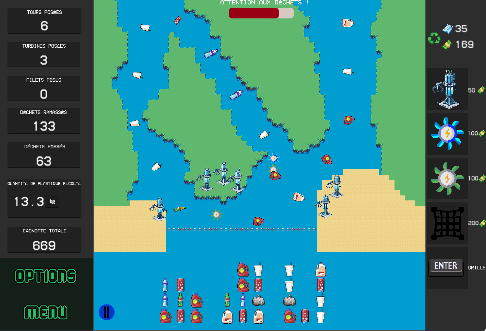
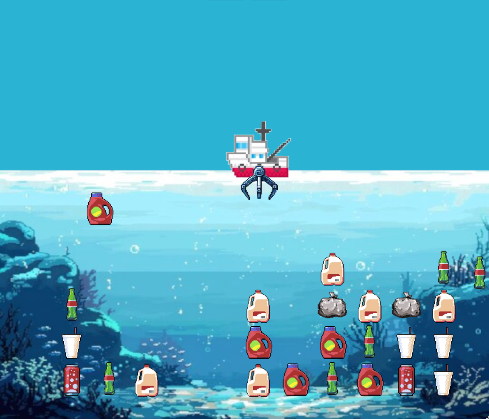

<div align="center">
   
   
   
</div>

# Defenseas

<div align="center">
   
</div>

_Also available in [French](#-version-française)._

**Defenseas** is a serious game developed with **Godot** as part of the *Jeux Sérieux*
course of the IMAGINE Computer Graphics Master's program at the University of
Montpellier. The goal: prevent waste from reaching the ocean by combining a
**Tower Defense** mode with a **Puzzle minigame**, all while raising awareness
about marine pollution.

> 🇫🇷 Please note that the game is entirely in French.

## Key features

- **Tower Defense mode:** place structures on a river map to intercept waste
  before it reaches the ocean.
- **Puzzle game mode:** switch to a mini-game where you align and recycle waste
  that already made it to the sea.
- **Economy system:** sell collected plastic to fund new structures, balance
  your income against your cleanup efficiency.
- **Wave-based progression:** waves get harder with faster and more waste.
- **Awareness feedback:** win or lose, the game always shows you a real
  environmental statistic.

## Gameplay

### Tower Defense

Manage your economy and place structures on the map to intercept waste flowing
down the river:

| Structure | Placement | Effect |
|---|---|---|
| **Turret** | Land | Shoots waste and teleports it to recycling factories |
| **Blue Turbine** | Water | Increases damage of nearby turrets |
| **Green Turbine** | Water | Increases fire rate of nearby turrets |
| **Net** | Water | Passively collects up to 10 waste items |

Sell your collected plastic for bonus rewards — the more you sell at once, the
better the payout:

| Quantity | Bonus |
|---|---|
| 100+ | +10% |
| 200+ | +20% |
| 300+ | +30% |
| 400+ | +40% |

> ⚠️ Let 35 waste items through and it's game over.

### Puzzle game

Press **Enter** to switch to the puzzle mode. Align at least 3 identical waste
items horizontally or vertically to eliminate them. Use the crane mounted on the boat to grab and move items.

## Screenshots

<div align="center">
   
   
</div>

## Controls

### Tower Defense
- **Left click**: select and place a structure
- **Right click**: cancel selection
- **Enter**: switch to puzzle game mode

### Puzzle minigame
- **Left / Right arrows**: move the boat
- **Down arrow**: lower the crane
- **Space**: grab / release a waste item
- **Enter**: return to tower defense mode

## How to run

Clone the repository :

```bash
git clone git@github.com:louis-jean0/Defenseas.git
```

and execute the corresponding file depending on your operating system : 

`ExecutableWindows/defenseas.exe` for Windows,

`ExecutableLinux/defenseas.sh` for Linux. **N.B** : you may need to give execution permissions to the file via chmod. 

Alternatively, after cloning the repository, open the project in **Godot 4.3**.
Then open `project.godot` in the Godot editor and press **F5** to run.

## License

This project is licensed under the MIT License — see the [LICENSE](LICENSE)
file for details.

## Authors

Brian Delvigne, Louis Jean, Loïc Kerbaul, Benjamin Serva  
*Master 2 IMAGINE — Université de Montpellier, 2024*

---

<details>
<summary>🇫🇷 Version française</summary>

# Defenseas

<div align="center">
   
</div>

**Defenseas** est un jeu sérieux développé avec **Godot** dans le cadre du cours
*Jeux Sérieux* du Master Informatique parcours IMAGINE de l'Université de
Montpellier. Objectif : empêcher les déchets d'atteindre l'océan en combinant
un mode **Tower Defense** et un **Puzzle minijeu**, tout en sensibilisant aux
enjeux de la pollution marine.

> 🇫🇷 Le jeu est entièrement en français.

## Fonctionnalités clés

- **Mode Tower Defense :** placez des structures sur une carte fluviale pour
  intercepter les déchets avant qu'ils n'atteignent l'océan.
- **Mode Puzzle minijeu :** switchez vers un mini-jeu où vous alignez et recyclez
  les déchets déjà tombés à la mer.
- **Système économique :** revendez le plastique collecté pour financer de
  nouvelles structures, trouvez le bon équilibre entre revenus et nettoyage.
- **Progression par vagues :** les vagues deviennent progressivement plus
  difficiles avec des déchets plus rapides et plus nombreux.
- **Feedback de sensibilisation :** victoire ou défaite, le jeu vous affiche
  toujours une vraie statistique environnementale.

## Gameplay

### Tower Defense

Gérez votre économie et placez des structures sur la carte pour intercepter les
déchets qui descendent la rivière :

| Structure | Placement | Effet |
|---|---|---|
| **Tourelle** | Terre | Tire sur les déchets et les téléporte vers les usines |
| **Turbine bleue** | Eau | Augmente les dégâts des tourelles à portée |
| **Turbine verte** | Eau | Augmente la cadence de tir des tourelles à portée |
| **Filet** | Eau | Récolte passivement jusqu'à 10 déchets |

Revendez votre plastique pour des bonus — plus vous vendez d'un coup, plus le
gain est élevé :

| Quantité | Bonus |
|---|---|
| 100+ | +10% |
| 200+ | +20% |
| 300+ | +30% |
| 400+ | +40% |

> ⚠️ Laissez passer 35 déchets et la partie est perdue.

### Puzzle minijeu

Appuyez sur **Entrée** pour passer en mode puzzle. Alignez au minimum 3 déchets
identiques horizontalement ou verticalement pour les éliminer. Utilisez la grue montée sur le bateau pour attraper et déplacer les déchets.

## Captures d'écran

<div align="center">
   
   
</div>

## Contrôles

### Tower Defense
- **Clic gauche** : sélectionner et placer une structure
- **Clic droit** : annuler la sélection
- **Entrée** : passer en mode puzzle

### Puzzle minijeu
- **Flèche gauche / droite** : déplacer le bateau
- **Flèche bas** : descendre la grue
- **Espace** : attraper / relâcher un déchet
- **Entrée** : revenir au mode Tower Defense

## Lancer le jeu

Clonez le dépôt :

```bash
git clone git@github.com:louis-jean0/Defenseas.git
```

puis lancez l'exécutable correspondant à votre système :

`ExecutableWindows/defenseas.exe` pour Windows,

`ExecutableLinux/defenseas.sh` pour Linux. **N.B** : vous devrez peut-être
attribuer les droits d'exécution via chmod.

Alternativement, après avoir cloné le dépôt, ouvrez le projet dans **Godot 4.3**,
puis ouvrez `project.godot` dans l'éditeur et appuyez sur **F5**.

## Licence

Ce projet est sous licence MIT — consultez le fichier [LICENSE](LICENSE) pour
plus de détails.

## Auteurs

Brian Delvigne, Louis Jean, Loïc Kerbaul, Benjamin Serva  
*Master 2 IMAGINE — Université de Montpellier, 2024*

</details>